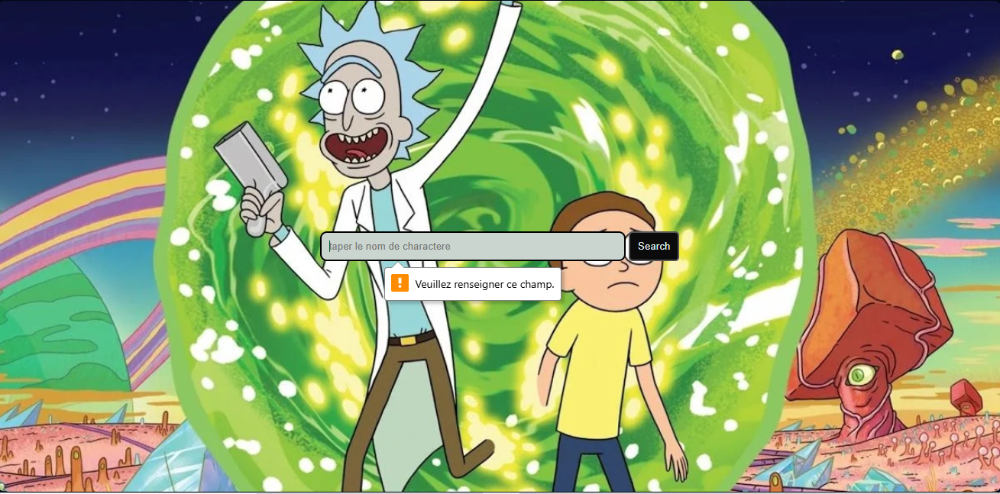

# 🛸 Rick & Morty - Service Oriented Architecture (SOA)

Projet universitaire utilisant une **architecture orientée services (SOA)** pour afficher et gérer des personnages issus de l'univers de Rick et Morty.

## 📌 Description

Ce projet a été développé dans un cadre d'apprentissage des architectures SOA. Il consomme l'API publique de Rick and Morty pour afficher une liste de personnages et leurs informations détaillées.

## 🧰 Technologies utilisées

- `Java` / `Spring Boot`
- `REST API`
- `JSON`
- `Maven`
- `Postman` (pour les tests)
- API externe : [https://rickandmortyapi.com/](https://rickandmortyapi.com/)

## 📦 Fonctionnalités

- 🔍 Récupération de la liste des personnages
- 👤 Affichage des détails d’un personnage
- 🔁 Architecture en microservices simulée
- 🧪 Tests d’API via Postman

## 📸 Aperçu



> ## 🙋‍♀️ Développeuse

**Wejden Ben Yaagoub**  
📍 Développeuse Full Stack  
🔗 [LinkedIn](https://www.linkedin.com/in/wejdenbenyaagoub/)  
📫 [benyaagoubwejden@gmail.com](mailto:benyaagoubwejden@gmail.com)


## 🚀 Installation

```bash
git clone https://github.com/wejdeen14/Rickymorty_SOA.git
cd Rickymorty_SOA
mvn spring-boot:run
